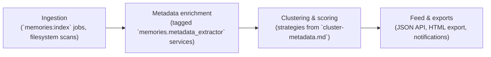

# Memories architecture overview

## End-to-end pipeline
The pipeline turns raw files into curated memories that can be surfaced via the feed API and exports. Each stage is implemented as Symfony services wired through `config/services.yaml` and enriched by configuration defaults from `config/parameters.yaml` (see [configuration-files.md](../configuration-files.md)).

- **Ingestion** pulls media from configured libraries, persists `Media` records, and queues enrichment work. Batch sizing is controlled by `memories.index.batch_size` (defaulted via `MEMORIES_INDEX_BATCH_SIZE`).
- **Metadata enrichment** runs the ordered pipeline declared through the `memories.metadata.pipeline.steps` parameter. Each extractor is tagged with `memories.metadata_extractor`, letting the orchestrator resolve priorities without manual wiring.
- **Clustering & scoring** combines temporal, spatial, and semantic signals described in [cluster-metadata.md](../cluster-metadata.md). The resulting `Cluster` entities aggregate members, scores, and derived geodata for downstream use.
- **Feed & exports** transform scored clusters into `MemoryFeedItem` view models consumed by the HTTP feed (`FeedController`) and exporters like `HtmlFeedExportService`.

## Core data models
- **`Media` (Doctrine entity, `src/Entity/Media.php`)**
  - Represents an imported asset including capture metadata, hashes, and technical properties (e.g., `path`, `takenAt`, `checksum`, `width`/`height`).
  - Holds optional relationships to `Location` data (via `location_id`) and is referenced by clusters through member join tables and the `key_media_id`.
  - Indexed columns such as `phashPrefix`, `geoCell8`, and `takenAt` accelerate duplicate checks, spatial searches, and timeline queries.
- **`Location` (Doctrine entity, `src/Entity/Location.php`)**
  - Stores normalised geocoding output with provider metadata (`provider`, `providerPlaceId`) and hierarchical address parts (country, city, suburb, road).
  - Linked from `Media` and `Cluster` entities to provide consistent place labeling and reuse enriched POI payloads.
  - Tracks refresh lifecycle via `refreshedAt`/`stale` flags to manage background updates from Nominatim and Overpass.
- **`Cluster` (Doctrine entity, `src/Entity/Cluster.php`)**
  - Captures algorithm output including strategy identifiers, time spans (`start_at`/`end_at`), scoring (`score`, `score_post_norm`), and geometry (`centroid_lat`, `bounding_box`).
  - Maintains relationships to its representative `Media` (`key_media_id`), dominant `Location`, and computed metadata stored in the JSON `meta` column.
  - Persists versioning markers like `algorithmVersion` and `configHash` to keep track of clustering runs when tuning parameters documented in [cluster-metadata.md](../cluster-metadata.md).
- **`MemoryFeedItem` (DTO, `src/Feed/MemoryFeedItem.php`)**
  - Immutable projection of a feed card bundling algorithm labels, UI copy (`title`, `subtitle`), cover media references, member identifiers, and ranking scores.
  - Downstream builders such as `MemoryFeedBuilder` and `NotificationPlanner` operate solely on this DTO to separate persistence concerns from presentation logic.
  - Supports score adjustments via `withScore()`, allowing ranking stages to overlay boosts without mutating earlier pipeline output.

## Configuration touchpoints
- `config/parameters.yaml`
  - Indexing defaults (`memories.index.*`) drive ingestion behaviour and align with the catalogue overview in [configuration-files.md](../configuration-files.md).
  - Video tooling parameters (`memories.video.ffmpeg_path`, `memories.video.ffprobe_path`) pull from `FFMPEG_PATH` / `FFPROBE_PATH` to keep enrichment binaries configurable.
  - Metadata orchestration toggles (`memories.metadata.pipeline.telemetry.enabled`) map to `MEMORIES_METADATA_PIPELINE_TELEMETRY`, enabling the tracing options referenced in [cluster-metadata.md](../cluster-metadata.md).
  - Clustering heuristics (`memories.cluster.*`, `memories.time.normalizer.*`) determine staypoint and vacation behaviour; see the deep dive in [cluster-metadata.md](../cluster-metadata.md) for guidance when adjusting them.
- Environment variables
  - `.env` / deployment settings mirror the `%env()%` lookups documented in [configuration-files.md](../configuration-files.md), including geocoding credentials (`NOMINATIM_BASE_URL`, `NOMINATIM_EMAIL`) and localisation defaults (`MEMORIES_PREFERRED_LOCALE`).
  - Feed export tuning leverages `MEMORIES_MODEL_CARD_DIR` and slideshow knobs like `MEMORIES_SLIDESHOW_DURATION_PER_IMAGE` when rendering storyboards.
- Service tags & autowiring
  - Metadata extractors share the `memories.metadata_extractor` tag for ordered execution.
  - Clustering strategies, consolidation stages, and selection phases register via tags such as `memories.cluster_strategy`, `memories.cluster_consolidation.stage`, and `memories.selection.stage.*`, keeping feature additions declarative.
  - Day-summary builders continue the pattern with `memories.day_summary_stage`, enabling pipeline composition without manual factory updates.

This document complements [configuration-files.md](../configuration-files.md) for parameter overviews and [cluster-metadata.md](../cluster-metadata.md) for algorithm-specific insights.
